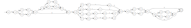
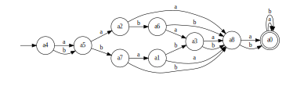

### Преобразование НКА в ДКА
\
Исходный автомат:
\
$A= \langle \sum_a, Q_a, s_a, T_a, \sigma_a \rangle$
\
$\sum_a= {a,b}$\
$Q_a = {a0,a1,a2,a3,a4,a5,a6,a7,a8,a9,b0,b1,b2,b3,b4,b5,b6,b7,b8,b9,c0,c1,c2,c3,c4,c5,c6,c7,c8,c9,d0,d1,d2,d3,d4,d5,d6,d7,d8,d9,e0,e1,e2,e3,e4}$\
$s_a = {a0}$\
$T_a = {e4}$\
$\sigma_a = $
\
\
Преобразуем в ДКА:
$A= \langle \sum_a, Q_a, s_a, T_a, \sigma_a \rangle$
\
$\sum_a= {a,b}$\
$Q_a = {a0,a1,a3,a5,a2,a4,a7,a9,b1,b3,b4,b6,b9,c2,c7,a7,a8,a9,b0,b1,b3,b4,b6,b7,b9,c2,c3,c7,a7,a8,a9,b0,b1,b3,b4,b5,b6,b7,b8,b9,c2,c3,c7,d2,d4,d6,a7,a8,a9,b0,b1,b3,b4,b5,b6,b7,b8,b9,c2,c3,c7,d2,d3,d4,d5,d6,d8,e0,e2,e4,a7,a8,a9,b0,b1,b3,b4,b5,b6,b7,b8,b9,c2,c3,c7,d2,d3,d4,d5,d6,d8,d9,e0,e1,e2,e4,a7,a8,a9,b1,b2,b3,b4,b6,b9,c0,c2,c4,c7,c8,d3,d7,d8,d9,e0,e2,e3,e4,a7,a8,a9,b0,b1,b3,b4,b6,b7,b9,c2,c3,c5,c7,c9,d8,d9,e0,e1,e2,e4,a7,a8,a9,b0,b1,b3,b4,b5,b6,b7,b8,b9,c2,c3,c7,d2,d4,d6,d8,d9,e0,e1,e2,e4,a7,a8,a9,b1,b2,b3,b4,b5,b6,b9,c0,c2,c4,c6,c7,c8,d0,d2,d4,d6,d8,d9,e0,e2,e3,e4,a7,a8,a9,b0,b1,b3,b4,b5,b6,b7,b9,c2,c3,c5,c7,c9,d1,d2,d3,d4,d5,d6,d8,d9,e0,e1,e2,e4,a7,a8,a9,b1,b2,b3,b4,b5,b6,b9,c0,c2,c4,c6,c7,c8,d0,d2,d3,d4,d6,d7,d8,d9,e0,e2,e3,e4,a7,a8,a9,b1,b2,b3,b4,b5,b6,b9,c0,c1,c2,c7,c8,d2,d3,d4,d6,d7,d8,d9,e0,e2,e3,e4,a7,a8,a9,b0,b1,b3,b4,b6,b7,b9,c2,c3,c7,c9,d3,d5,d8,d9,e0,e1,e2,e4,a7,a8,a9,b1,b2,b3,b4,b6,b9,c0,c2,c4,c7,c8,d0,d8,d9,e0,e2,e3,e4,a7,a8,a9,b0,b1,b3,b4,b5,b6,b7,b9,c2,c3,c5,c7,c9,d1,d2,d4,d6,d8,d9,e0,e1,e2,e4,a7,a8,a9,b1,b2,b3,b4,b5,b6,b9,c0,c1,c2,c7,c8,d2,d4,d6,d8,d9,e0,e2,e3,e4,a7,a8,a9,b1,b2,b3,b4,b6,b9,c0,c2,c4,c7,c8,d3,d7,d8,e0,e2,e4,a7,a8,a9,b1,b2,b3,b4,b6,b9,c0,c2,c4,c7,c8,a7,a8,a9,b0,b1,b3,b4,b6,b7,b9,c2,c3,c5,c7,c9,a7,a8,a9,b1,b2,b3,b4,b5,b6,b9,c0,c2,c4,c6,c7,c8,d0,d2,d4,d6,a7,a8,a9,b0,b1,b3,b4,b5,b6,b7,b9,c2,c3,c5,c7,c9,d1,d2,d3,d4,d5,d6,d8,e0,e2,e4,a7,a8,a9,b1,b2,b3,b4,b5,b6,b9,c0,c1,c2,c7,c8,d2,d3,d4,d6,d7,d8,e0,e2,e4,a7,a8,a9,b1,b2,b3,b4,b5,b6,b9,c0,c1,c2,c7,c8,d2,d4,d6,a7,a8,a9,b0,b1,b3,b4,b6,b7,b9,c2,c3,c7,c9,d3,d5,d8,e0,e2,e4,a7,a8,a9,b1,b2,b3,b4,b6,b9,c0,c2,c7,c8,a7,a8,a9,b0,b1,b3,b4,b6,b7,b9,c2,c3,c7,c9,a7,a8,a9,b1,b2,b3,b4,b6,b9,c0,c2,c4,c7,c8,d0,a7,a8,a9,b0,b1,b3,b4,b5,b6,b7,b9,c2,c3,c5,c7,c9,d1,d2,d4,d6,a7,a8,a9,b1,b2,b3,b4,b5,b6,b9,c0,c2,c4,c6,c7,c8,d0,d2,d3,d4,d6,d7,d8,e0,e2,e4,a2,a6,a7,a9,b1,b3,b4,b6,b9,c2,c7}$\
$s_a = {a0,a1,a3,a5}$\
$T_a = {a7,a8,a9,b0,b1,b3,b4,b5,b6,b7,b8,b9,c2,c3,c7,d2,d3,d4,d5,d6,d8,e0,e2,e4,a7,a8,a9,b0,b1,b3,b4,b5,b6,b7,b8,b9,c2,c3,c7,d2,d3,d4,d5,d6,d8,d9,e0,e1,e2,e4,a7,a8,a9,b1,b2,b3,b4,b6,b9,c0,c2,c4,c7,c8,d3,d7,d8,d9,e0,e2,e3,e4,a7,a8,a9,b0,b1,b3,b4,b6,b7,b9,c2,c3,c5,c7,c9,d8,d9,e0,e1,e2,e4,a7,a8,a9,b0,b1,b3,b4,b5,b6,b7,b8,b9,c2,c3,c7,d2,d4,d6,d8,d9,e0,e1,e2,e4,a7,a8,a9,b1,b2,b3,b4,b5,b6,b9,c0,c2,c4,c6,c7,c8,d0,d2,d4,d6,d8,d9,e0,e2,e3,e4,a7,a8,a9,b0,b1,b3,b4,b5,b6,b7,b9,c2,c3,c5,c7,c9,d1,d2,d3,d4,d5,d6,d8,d9,e0,e1,e2,e4,a7,a8,a9,b1,b2,b3,b4,b5,b6,b9,c0,c2,c4,c6,c7,c8,d0,d2,d3,d4,d6,d7,d8,d9,e0,e2,e3,e4,a7,a8,a9,b1,b2,b3,b4,b5,b6,b9,c0,c1,c2,c7,c8,d2,d3,d4,d6,d7,d8,d9,e0,e2,e3,e4,a7,a8,a9,b0,b1,b3,b4,b6,b7,b9,c2,c3,c7,c9,d3,d5,d8,d9,e0,e1,e2,e4,a7,a8,a9,b1,b2,b3,b4,b6,b9,c0,c2,c4,c7,c8,d0,d8,d9,e0,e2,e3,e4,a7,a8,a9,b0,b1,b3,b4,b5,b6,b7,b9,c2,c3,c5,c7,c9,d1,d2,d4,d6,d8,d9,e0,e1,e2,e4,a7,a8,a9,b1,b2,b3,b4,b5,b6,b9,c0,c1,c2,c7,c8,d2,d4,d6,d8,d9,e0,e2,e3,e4,a7,a8,a9,b1,b2,b3,b4,b6,b9,c0,c2,c4,c7,c8,d3,d7,d8,e0,e2,e4,a7,a8,a9,b0,b1,b3,b4,b5,b6,b7,b9,c2,c3,c5,c7,c9,d1,d2,d3,d4,d5,d6,d8,e0,e2,e4,a7,a8,a9,b1,b2,b3,b4,b5,b6,b9,c0,c1,c2,c7,c8,d2,d3,d4,d6,d7,d8,e0,e2,e4,a7,a8,a9,b0,b1,b3,b4,b6,b7,b9,c2,c3,c7,c9,d3,d5,d8,e0,e2,e4,a7,a8,a9,b1,b2,b3,b4,b5,b6,b9,c0,c2,c4,c6,c7,c8,d0,d2,d3,d4,d6,d7,d8,e0,e2,e4}$\
$\sigma_a = $
 | |a|b|$\lambda$ |
 | -- | -- | -- | -- | 
|$\langle a0,a1,a3,a5 \rangle$|$\langle a2,a4,a7,a9,b1,b3,b4,b6,b9,c2,c7 \rangle$|$\langle a7,a8,a9,b1,b2,b3,b4,b6,b9,c0,c2,c7,c8 \rangle$|$\langle  \rangle$|
|$\langle a2,a4,a7,a9,b1,b3,b4,b6,b9,c2,c7 \rangle$|$\langle a2,a4,a7,a9,b1,b3,b4,b6,b9,c2,c7 \rangle$|$\langle a7,a8,a9,b1,b2,b3,b4,b6,b9,c0,c2,c7,c8 \rangle$|$\langle  \rangle$|
|$\langle a7,a8,a9,b0,b1,b3,b4,b6,b7,b9,c2,c3,c7 \rangle$|$\langle a2,a4,a7,a9,b1,b3,b4,b6,b9,c2,c7 \rangle$|$\langle a7,a8,a9,b1,b2,b3,b4,b6,b9,c0,c2,c7,c8 \rangle$|$\langle  \rangle$|
|$\langle a7,a8,a9,b0,b1,b3,b4,b5,b6,b7,b8,b9,c2,c3,c7,d2,d4,d6 \rangle$|$\langle a2,a4,a7,a9,b1,b3,b4,b6,b9,c2,c7 \rangle$|$\langle a7,a8,a9,b1,b2,b3,b4,b6,b9,c0,c2,c7,c8 \rangle$|$\langle  \rangle$|
|$\langle a7,a8,a9,b0,b1,b3,b4,b5,b6,b7,b8,b9,c2,c3,c7,d2,d3,d4,d5,d6,d8,e0,e2,e4 \rangle$|$\langle a2,a4,a7,a9,b1,b3,b4,b6,b9,c2,c7 \rangle$|$\langle a7,a8,a9,b1,b2,b3,b4,b6,b9,c0,c2,c7,c8 \rangle$|$\langle  \rangle$|
|$\langle a7,a8,a9,b0,b1,b3,b4,b5,b6,b7,b8,b9,c2,c3,c7,d2,d3,d4,d5,d6,d8,d9,e0,e1,e2,e4 \rangle$|$\langle a2,a4,a7,a9,b1,b3,b4,b6,b9,c2,c7 \rangle$|$\langle a7,a8,a9,b1,b2,b3,b4,b6,b9,c0,c2,c7,c8 \rangle$|$\langle  \rangle$|
|$\langle a7,a8,a9,b1,b2,b3,b4,b6,b9,c0,c2,c4,c7,c8,d3,d7,d8,d9,e0,e2,e3,e4 \rangle$|$\langle a2,a4,a7,a9,b1,b3,b4,b6,b9,c2,c7 \rangle$|$\langle a7,a8,a9,b1,b2,b3,b4,b6,b9,c0,c2,c7,c8 \rangle$|$\langle  \rangle$|
|$\langle a7,a8,a9,b0,b1,b3,b4,b6,b7,b9,c2,c3,c5,c7,c9,d8,d9,e0,e1,e2,e4 \rangle$|$\langle a2,a4,a7,a9,b1,b3,b4,b6,b9,c2,c7 \rangle$|$\langle a7,a8,a9,b1,b2,b3,b4,b6,b9,c0,c2,c7,c8 \rangle$|$\langle  \rangle$|
|$\langle a7,a8,a9,b0,b1,b3,b4,b5,b6,b7,b8,b9,c2,c3,c7,d2,d4,d6,d8,d9,e0,e1,e2,e4 \rangle$|$\langle a2,a4,a7,a9,b1,b3,b4,b6,b9,c2,c7 \rangle$|$\langle a7,a8,a9,b1,b2,b3,b4,b6,b9,c0,c2,c7,c8 \rangle$|$\langle  \rangle$|
|$\langle a7,a8,a9,b1,b2,b3,b4,b5,b6,b9,c0,c2,c4,c6,c7,c8,d0,d2,d4,d6,d8,d9,e0,e2,e3,e4 \rangle$|$\langle a2,a4,a7,a9,b1,b3,b4,b6,b9,c2,c7 \rangle$|$\langle a7,a8,a9,b1,b2,b3,b4,b6,b9,c0,c2,c7,c8 \rangle$|$\langle  \rangle$|
|$\langle a7,a8,a9,b0,b1,b3,b4,b5,b6,b7,b9,c2,c3,c5,c7,c9,d1,d2,d3,d4,d5,d6,d8,d9,e0,e1,e2,e4 \rangle$|$\langle a2,a4,a7,a9,b1,b3,b4,b6,b9,c2,c7 \rangle$|$\langle a7,a8,a9,b1,b2,b3,b4,b6,b9,c0,c2,c7,c8 \rangle$|$\langle  \rangle$|
|$\langle a7,a8,a9,b1,b2,b3,b4,b5,b6,b9,c0,c2,c4,c6,c7,c8,d0,d2,d3,d4,d6,d7,d8,d9,e0,e2,e3,e4 \rangle$|$\langle a2,a4,a7,a9,b1,b3,b4,b6,b9,c2,c7 \rangle$|$\langle a7,a8,a9,b1,b2,b3,b4,b6,b9,c0,c2,c7,c8 \rangle$|$\langle  \rangle$|
|$\langle a7,a8,a9,b1,b2,b3,b4,b5,b6,b9,c0,c1,c2,c7,c8,d2,d3,d4,d6,d7,d8,d9,e0,e2,e3,e4 \rangle$|$\langle a2,a4,a7,a9,b1,b3,b4,b6,b9,c2,c7 \rangle$|$\langle a7,a8,a9,b1,b2,b3,b4,b6,b9,c0,c2,c7,c8 \rangle$|$\langle  \rangle$|
|$\langle a7,a8,a9,b0,b1,b3,b4,b6,b7,b9,c2,c3,c7,c9,d3,d5,d8,d9,e0,e1,e2,e4 \rangle$|$\langle a2,a4,a7,a9,b1,b3,b4,b6,b9,c2,c7 \rangle$|$\langle a7,a8,a9,b1,b2,b3,b4,b6,b9,c0,c2,c7,c8 \rangle$|$\langle  \rangle$|
|$\langle a7,a8,a9,b1,b2,b3,b4,b6,b9,c0,c2,c4,c7,c8,d0,d8,d9,e0,e2,e3,e4 \rangle$|$\langle a2,a4,a7,a9,b1,b3,b4,b6,b9,c2,c7 \rangle$|$\langle a7,a8,a9,b1,b2,b3,b4,b6,b9,c0,c2,c7,c8 \rangle$|$\langle  \rangle$|
|$\langle a7,a8,a9,b0,b1,b3,b4,b5,b6,b7,b9,c2,c3,c5,c7,c9,d1,d2,d4,d6,d8,d9,e0,e1,e2,e4 \rangle$|$\langle a2,a4,a7,a9,b1,b3,b4,b6,b9,c2,c7 \rangle$|$\langle a7,a8,a9,b1,b2,b3,b4,b6,b9,c0,c2,c7,c8 \rangle$|$\langle  \rangle$|
|$\langle a7,a8,a9,b1,b2,b3,b4,b5,b6,b9,c0,c1,c2,c7,c8,d2,d4,d6,d8,d9,e0,e2,e3,e4 \rangle$|$\langle a2,a4,a7,a9,b1,b3,b4,b6,b9,c2,c7 \rangle$|$\langle a7,a8,a9,b1,b2,b3,b4,b6,b9,c0,c2,c7,c8 \rangle$|$\langle  \rangle$|
|$\langle a7,a8,a9,b1,b2,b3,b4,b6,b9,c0,c2,c4,c7,c8,d3,d7,d8,e0,e2,e4 \rangle$|$\langle a2,a4,a7,a9,b1,b3,b4,b6,b9,c2,c7 \rangle$|$\langle a7,a8,a9,b1,b2,b3,b4,b6,b9,c0,c2,c7,c8 \rangle$|$\langle  \rangle$|
|$\langle a7,a8,a9,b1,b2,b3,b4,b6,b9,c0,c2,c4,c7,c8 \rangle$|$\langle a2,a4,a7,a9,b1,b3,b4,b6,b9,c2,c7 \rangle$|$\langle a7,a8,a9,b1,b2,b3,b4,b6,b9,c0,c2,c7,c8 \rangle$|$\langle  \rangle$|
|$\langle a7,a8,a9,b0,b1,b3,b4,b6,b7,b9,c2,c3,c5,c7,c9 \rangle$|$\langle a2,a4,a7,a9,b1,b3,b4,b6,b9,c2,c7 \rangle$|$\langle a7,a8,a9,b1,b2,b3,b4,b6,b9,c0,c2,c7,c8 \rangle$|$\langle  \rangle$|
|$\langle a7,a8,a9,b1,b2,b3,b4,b5,b6,b9,c0,c2,c4,c6,c7,c8,d0,d2,d4,d6 \rangle$|$\langle a2,a4,a7,a9,b1,b3,b4,b6,b9,c2,c7 \rangle$|$\langle a7,a8,a9,b1,b2,b3,b4,b6,b9,c0,c2,c7,c8 \rangle$|$\langle  \rangle$|
|$\langle a7,a8,a9,b0,b1,b3,b4,b5,b6,b7,b9,c2,c3,c5,c7,c9,d1,d2,d3,d4,d5,d6,d8,e0,e2,e4 \rangle$|$\langle a2,a4,a7,a9,b1,b3,b4,b6,b9,c2,c7 \rangle$|$\langle a7,a8,a9,b1,b2,b3,b4,b6,b9,c0,c2,c7,c8 \rangle$|$\langle  \rangle$|
|$\langle a7,a8,a9,b1,b2,b3,b4,b5,b6,b9,c0,c1,c2,c7,c8,d2,d3,d4,d6,d7,d8,e0,e2,e4 \rangle$|$\langle a2,a4,a7,a9,b1,b3,b4,b6,b9,c2,c7 \rangle$|$\langle a7,a8,a9,b1,b2,b3,b4,b6,b9,c0,c2,c7,c8 \rangle$|$\langle  \rangle$|
|$\langle a7,a8,a9,b1,b2,b3,b4,b5,b6,b9,c0,c1,c2,c7,c8,d2,d4,d6 \rangle$|$\langle a2,a4,a7,a9,b1,b3,b4,b6,b9,c2,c7 \rangle$|$\langle a7,a8,a9,b1,b2,b3,b4,b6,b9,c0,c2,c7,c8 \rangle$|$\langle  \rangle$|
|$\langle a7,a8,a9,b0,b1,b3,b4,b6,b7,b9,c2,c3,c7,c9,d3,d5,d8,e0,e2,e4 \rangle$|$\langle a2,a4,a7,a9,b1,b3,b4,b6,b9,c2,c7 \rangle$|$\langle a7,a8,a9,b1,b2,b3,b4,b6,b9,c0,c2,c7,c8 \rangle$|$\langle  \rangle$|
|$\langle a7,a8,a9,b1,b2,b3,b4,b6,b9,c0,c2,c7,c8 \rangle$|$\langle a2,a4,a7,a9,b1,b3,b4,b6,b9,c2,c7 \rangle$|$\langle a7,a8,a9,b1,b2,b3,b4,b6,b9,c0,c2,c7,c8 \rangle$|$\langle  \rangle$|
|$\langle a7,a8,a9,b0,b1,b3,b4,b6,b7,b9,c2,c3,c7,c9 \rangle$|$\langle a2,a4,a7,a9,b1,b3,b4,b6,b9,c2,c7 \rangle$|$\langle a7,a8,a9,b1,b2,b3,b4,b6,b9,c0,c2,c7,c8 \rangle$|$\langle  \rangle$|
|$\langle a7,a8,a9,b1,b2,b3,b4,b6,b9,c0,c2,c4,c7,c8,d0 \rangle$|$\langle a2,a4,a7,a9,b1,b3,b4,b6,b9,c2,c7 \rangle$|$\langle a7,a8,a9,b1,b2,b3,b4,b6,b9,c0,c2,c7,c8 \rangle$|$\langle  \rangle$|
|$\langle a7,a8,a9,b0,b1,b3,b4,b5,b6,b7,b9,c2,c3,c5,c7,c9,d1,d2,d4,d6 \rangle$|$\langle a2,a4,a7,a9,b1,b3,b4,b6,b9,c2,c7 \rangle$|$\langle a7,a8,a9,b1,b2,b3,b4,b6,b9,c0,c2,c7,c8 \rangle$|$\langle  \rangle$|
|$\langle a7,a8,a9,b1,b2,b3,b4,b5,b6,b9,c0,c2,c4,c6,c7,c8,d0,d2,d3,d4,d6,d7,d8,e0,e2,e4 \rangle$|$\langle a2,a4,a7,a9,b1,b3,b4,b6,b9,c2,c7 \rangle$|$\langle a7,a8,a9,b1,b2,b3,b4,b6,b9,c0,c2,c7,c8 \rangle$|$\langle  \rangle$|
|$\langle a2,a6,a7,a9,b1,b3,b4,b6,b9,c2,c7 \rangle$|$\langle a2,a4,a7,a9,b1,b3,b4,b6,b9,c2,c7 \rangle$|$\langle a7,a8,a9,b1,b2,b3,b4,b6,b9,c0,c2,c7,c8 \rangle$|$\langle  \rangle$|

\
минимизируем ДКА и переименуем вершины:
$A= \langle \sum_a, Q_a, s_a, T_a, \sigma_a \rangle$
\
$\sum_a= {a,b}$\
$Q_a = {a0,a1,a2,a3,a4,a5,a6,a7,a8}$\
$s_a = {a4}$\
$T_a = {a0}$\
$\sigma_a = $
\
